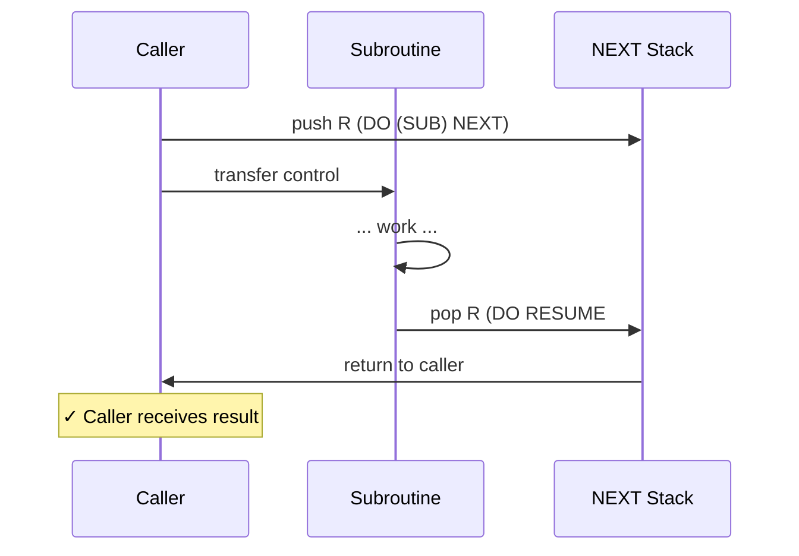
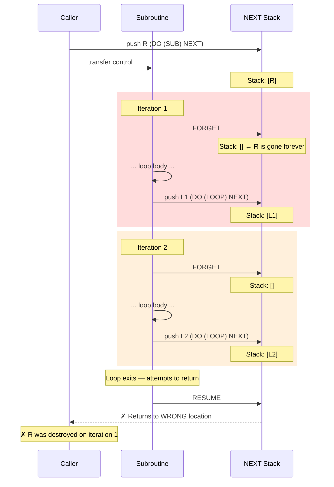
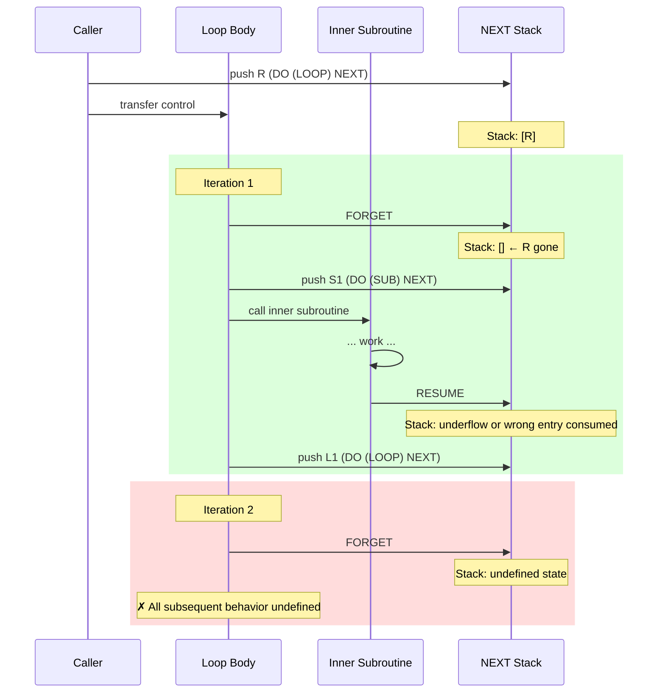
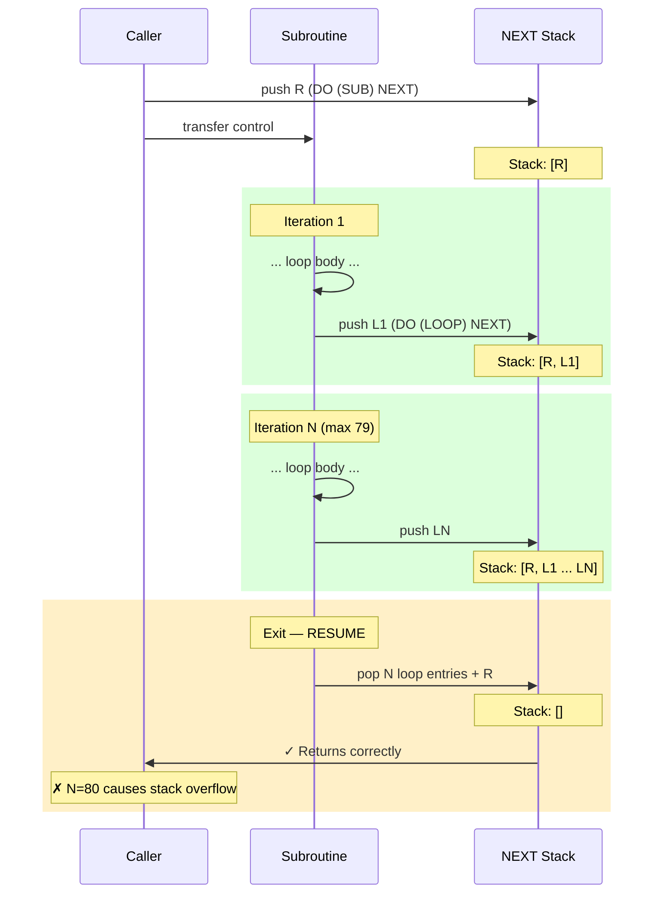
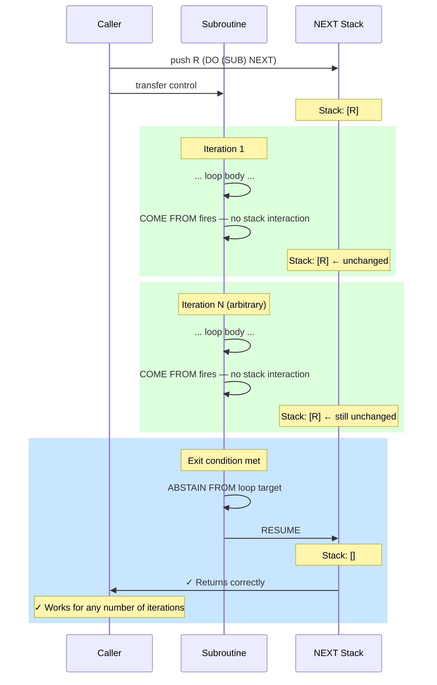
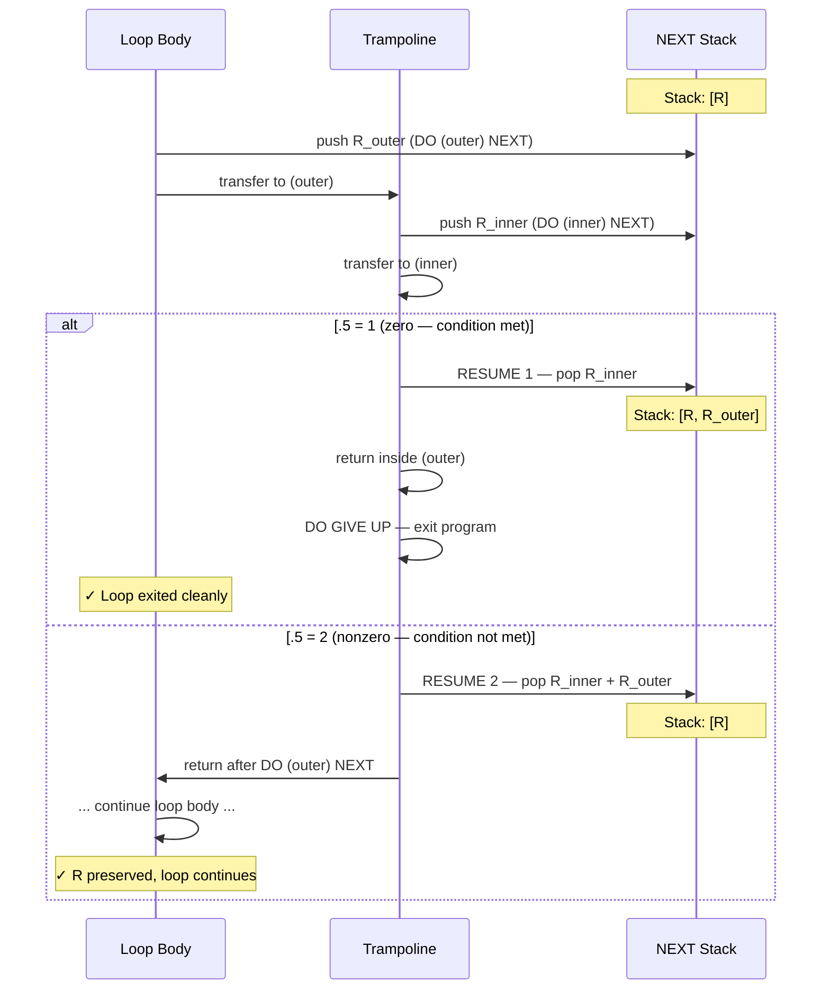

# COME FROM Considered Necessary

**Jason Whittington and Claude (Anthropic)**

Submitted to SIGBOVIK 2026

-----

## Abstract

Dijkstra (1968) proposed that the GO TO statement be abolished from higher-level programming languages. We are here to strengthen his work. We present a formal analysis of the control flow model of INTERCAL-72, the original INTERCAL specification as published by Woods and Lyon in 1972, and prove that INTERCAL-72 is incapable of expressing callable subroutines containing loops of arbitrary length. This limitation follows directly from the semantics of the FORGET statement and the bounded depth of the NEXT stack. We characterize the precise boundary: a callable subroutine in INTERCAL-72 may iterate at most 79 times before exhausting available stack depth. We then examine the COME FROM statement, introduced by Raymond in 1990, and demonstrate that it resolves this limitation completely. COME FROM loops do not interact with the NEXT stack and compose freely with subroutine calls. Raymond, recognizing the incompleteness of the original language, addressed it with characteristic wit. We conclude that COME FROM is not a joke. It is necessary. The language was provably incomplete from 1972 to 1990.

-----

## 1. Introduction

INTERCAL (Compiler Language With No Pronounceable Acronym) was created in 1972 by Donald R. Woods and James M. Lyon at Princeton University as a deliberate parody of contemporary programming languages (Woods and Lyon, 1972). The language was designed to be as different as possible from all existing languages of the time. It succeeded. INTERCAL provides no conventional arithmetic operators, enforces a politeness requirement on source code, and offers control flow mechanisms that bear no resemblance to those of any other language.

Despite its origins as a parody, INTERCAL has attracted sustained attention from the programming language community. Several complete implementations exist, the language has been extended in multiple directions, and a small but non-trivial corpus of programs has been written in it. The present authors have recently extended INTERCAL to support 64-bit integer arithmetic and have implemented Warnsdorff’s algorithm for the Knight’s Tour and a Hilbert curve geographic indexing system in the extended language (Whittington and Claude, 2026a; Whittington and Claude, 2026b).

In the course of this implementation work, we encountered a fundamental limitation of INTERCAL’s control flow model that, to our knowledge, has not been formally described in the literature. This paper presents that limitation, proves it formally, characterizes its practical consequences, and demonstrates that it was resolved — apparently with full awareness of its significance — by Raymond’s introduction of the COME FROM statement in 1990.

The analysis in Sections 2 through 5 concerns strictly INTERCAL-72 as specified by Woods and Lyon. No extensions are assumed. Section 6 introduces the relevant extension and analyzes its effect.

-----

## 2. Background: INTERCAL-72 Control Flow

INTERCAL-72 provides three mechanisms for control flow. We describe each in turn.

### 2.1 The NEXT Stack: NEXT, RESUME, and FORGET

The primary subroutine mechanism uses a bounded stack of return addresses called the NEXT stack. The stack has a maximum depth of 80 entries, a limit established by tradition in all known implementations.

The **NEXT** statement transfers control to a labeled statement and pushes a return address onto the NEXT stack:

```intercal
DO (100) NEXT
```

This pushes the address of the statement following the NEXT onto the stack and transfers control to label (100).

The **RESUME** statement pops N entries from the NEXT stack and transfers control to the address at the top after popping:

```intercal
DO RESUME #1
```

This pops one entry and returns to the statement following the NEXT call that pushed it.

The **FORGET** statement discards N entries from the NEXT stack without transferring control:

```intercal
DO FORGET #1
```

This discards the top entry silently. Execution continues at the next sequential statement.

FORGET exists to manage the stack depth during iteration. The idiomatic INTERCAL loop uses FORGET at the top of the loop body to discard the return address pushed by the previous iteration’s NEXT call, keeping the stack depth constant:

```intercal
(100) DO FORGET #1
      ... loop body ...
      DO (100) NEXT
```

On each iteration, the NEXT at the bottom pushes a new return address, and the FORGET at the top of the next iteration discards it. The stack depth remains constant throughout. Figure 1 illustrates the normal operation of NEXT and RESUME in a subroutine without a loop.

**Figure 1: Working subroutine — normal NEXT/RESUME operation.**



### 2.2 ABSTAIN and REINSTATE

The **ABSTAIN** statement causes a labeled statement to be skipped when execution reaches it:

```intercal
DO ABSTAIN FROM (200)
```

The **REINSTATE** statement reverses a prior ABSTAIN:

```intercal
DO REINSTATE (200)
```

ABSTAIN and REINSTATE operate on global state. An ABSTAINed statement is skipped regardless of how execution arrives at it. These statements are used for conditional execution and, in combination with NEXT/RESUME trampolines, for branching.

### 2.3 Comparison and Branching

INTERCAL provides no comparison operators. Conditional branching is achieved through the double-NEXT trampoline idiom, which uses the zero-test expression to produce a value of 1 or 2, and RESUME to pop 1 or 2 entries from the stack, effectively choosing between two execution paths. The zero-test expression for a variable `.1` is:

```intercal
'?"!1~.1'~#1"$#1'~#3
```

This evaluates to 1 when `.1` is zero and 2 when `.1` is nonzero. The result is used as the argument to RESUME to select between two paths established by a pair of NEXT calls.

-----

## 3. The Fundamental Limitation of INTERCAL-72

We now state and prove the central results of this paper.

### 3.1 Definitions

We define a **callable subroutine** as a sequence of statements beginning at a labeled entry point, reachable via a NEXT call from some other location in the program, and expected to return control to the call site via RESUME.

We define a **FORGET-based loop** as a loop implemented using the idiomatic pattern described in Section 2.1: FORGET at the top of the loop body, NEXT at the bottom, with the loop iterating until some exit condition is met.

We define the **caller’s return address** R as the entry pushed onto the NEXT stack by the NEXT call that invoked the subroutine.

### 3.2 Lemma 1: A FORGET-based loop cannot be contained within a callable subroutine

**Proof.**

Let S be a callable subroutine containing a FORGET-based loop. Let the subroutine be invoked by the statement `DO (S) NEXT` at the call site. This pushes R onto the NEXT stack.

At the moment the subroutine begins executing, R is the top entry on the NEXT stack, assuming no NEXT statements have executed inside S before the loop. The FORGET-based loop begins with `DO FORGET #1`.

On the first iteration, `DO FORGET #1` discards the top entry of the NEXT stack. The top entry at this moment is R. Therefore R is discarded on the first iteration.

No subsequent RESUME statement can return to the call site, because R no longer exists on the NEXT stack. RESUME #N for any N will pop entries belonging to callers of the call site, or will fail with a stack underflow error.

Therefore S cannot return to its caller. Since S was defined to be a callable subroutine — one that returns to its call site — this is a contradiction. No such S exists. □

Figure 2 illustrates the failure mode.

**Figure 2: FORGET loop inside a callable subroutine — R destroyed on first iteration.**



**Remark on the sacrificial NEXT pattern.** One might attempt to protect R by pushing a sacrificial entry before the loop:

```intercal
(S)    DO (SACRIFICE) NEXT
(SACRIFICE) DO RESUME #1
```

This pushes and immediately pops a sacrificial entry, leaving the stack unchanged with R still on top. The first FORGET still discards R. The pattern does not resolve the problem.

### 3.3 Lemma 2: A FORGET-based loop cannot call subroutines

**Proof.**

Let L be a FORGET-based loop that calls a subroutine T via `DO (T) NEXT` during each iteration. Each NEXT call pushes an entry E onto the stack. T executes and returns via `DO RESUME #1`, which pops E. At the bottom of the loop iteration, `DO (L) NEXT` pushes a new loop entry.

On the next iteration, `DO FORGET #1` at the top of L discards the top entry. If T’s RESUME #1 popped its own entry cleanly, the top entry is the loop’s own structural NEXT entry — which FORGET correctly discards.

However, if T internally uses RESUME #N for N > 1 — as all syslib routines using the trampoline idiom do — T pops additional entries beyond its own. These additional entries belong to the loop’s stack accounting. FORGET on the next iteration then discards entries that are no longer in the expected position, producing undefined stack state.

In the general case, any subroutine T that uses the double-NEXT trampoline pattern for branching will execute RESUME #2, popping its own entry and one additional entry. This systematically corrupts the loop’s stack accounting. After two iterations the stack state is undefined. □

Figure 5 illustrates the interaction.

**Figure 5: Calling a subroutine from inside a FORGET loop — stack corruption by iteration 2.**



**Corollary (79-iteration bound).** ¹ The only loop construct in INTERCAL-72 that avoids Lemmas 1 and 2 is the stack-accumulating loop: NEXT at the bottom with no FORGET, and a single RESUME #(N+1) at exit to pop all N loop entries plus R. This is bounded by the NEXT stack limit: N + 1 ≤ 80, so N ≤ 79.

Figure 3 illustrates this pattern.

**Figure 3: Bounded stack-accumulating loop — correct but limited to 79 iterations.**



-----

## 4. Illustration of the Failure

We illustrate Lemmas 1 and 2 with a concrete case drawn from our implementation work: a loop that iterates over a sorted array of 64-bit Hilbert curve indices and identifies those falling within a geographic query range.

The following listing shows the control flow structure of the FORGET-based loop body, with mutation operations removed for clarity. The complete implementation is longer.

```intercal
        (8100) DO FORGET #1
               DO REINSTATE (8109)
               DO REINSTATE (8129)
               DO REINSTATE (8139)
               PLEASE DO (1000) NEXT
               DO (1500) NEXT
               DO (1500) NEXT
               DO (1500) NEXT
               DO (1500) NEXT
               DO (1500) NEXT
               DO (1500) NEXT
               DO (1500) NEXT
               DO (1500) NEXT
               DO (8128) NEXT
               DO (8125) NEXT
        (8128) DO (8129) NEXT
               DO ABSTAIN FROM (8129)
        (8129) DO RESUME .5
               DO FORGET #1
        (8125) DO NOTE FLAG1
               DO (1500) NEXT
               DO (1500) NEXT
               DO (1500) NEXT
               DO (1500) NEXT
               DO (1500) NEXT
               DO (1500) NEXT
               DO (1500) NEXT
               DO (1500) NEXT
               DO (8138) NEXT
               DO (8135) NEXT
        (8138) DO (8139) NEXT
               DO ABSTAIN FROM (8139)
        (8139) DO RESUME .5
               DO FORGET #1
        (8135) DO NOTE FLAG2
               PLEASE DO (1000) NEXT
               DO (1010) NEXT
               DO REINSTATE (8149)
               DO (8148) NEXT
               DO (8150) NEXT
        (8148) DO (8149) NEXT
               DO ABSTAIN FROM (8149)
        (8149) DO RESUME .1
               DO FORGET #1
        (8150) DO .1 <- #10
               PLEASE DO (1010) NEXT
               DO (8108) NEXT
               PLEASE DO (8100) NEXT
        (8108) DO (8109) NEXT
               DO ABSTAIN FROM (8109)
        (8109) DO RESUME .1
```

Per iteration this structure executes: 1 FORGET at line (8100); 3 REINSTATEs; 18 NEXT calls (16 calls to syslib routine (1500), 1 to (1000), 1 to (1010)); 3 nested trampolines each performing ABSTAIN and RESUME; and 2 additional FORGETs inside the trampolines at (8129) and (8139).

Each call to syslib routine (1500) executes RESUME #2 internally, popping two entries from the NEXT stack. Sixteen such calls per iteration produce 32 stack pops from syslib alone. The FORGET at (8100) on the next iteration discards an entry that is no longer in the position the loop’s accounting assumes.

By the second iteration the stack state is undefined. By the third iteration it is chaos. The program does not produce correct output.

This is not a programming error. It is a consequence of FORGET being indiscriminate in the presence of subroutine calls that themselves manipulate the stack. The interactions are formally unmanageable in INTERCAL-72, as established by Lemma 2.

-----

## 5. Eighteen Years of Incompleteness

The limitation proved in Section 3 was present in INTERCAL from its publication in 1972. The language as specified by Woods and Lyon provides no mechanism for a callable subroutine to contain a loop that calls other subroutines, nor any loop exceeding 79 iterations.

This went unnoticed for eighteen years. The explanation is straightforward: the corpus of INTERCAL programs written before 1990 was extremely small — the original manual notes that only two programs had ever been written in the language at the time of publication — and none of them required callable loops of arbitrary length or loops that called non-trivial subroutines.

-----

## 6. COME FROM

In 1990, Eric S. Raymond produced C-INTERCAL, a complete reimplementation of INTERCAL in C for Unix systems. Among the extensions Raymond introduced was the COME FROM statement, attributed to a proposal by R. L. Clark in Datamation magazine in 1973 (Clark, 1973).

The statement is described in the C-INTERCAL manual as the logical inverse of GO TO. When execution reaches the label referenced by a COME FROM statement, control transfers immediately to the COME FROM statement itself, regardless of the sequential flow of the program:

```intercal
DO COME FROM (300)
```

When execution reaches label (300) anywhere in the program, control transfers to the statement following this COME FROM. COME FROM does not interact with the NEXT stack in any way.

Raymond was aware that this addition addressed a genuine gap in the language’s expressive power. That he chose to present it as a joke is a mark of his wit rather than evidence of accidental discovery. The result is a necessary language feature wearing a costume.

### 6.1 Stack Independence

The critical property of COME FROM is that it does not interact with the NEXT stack in any way. A COME FROM loop:

```intercal
(LOOP)    DO COME FROM (LOOP_END)
          ... loop body ...
(LOOP_END) DO .1 <- .1
```

iterates by transferring control from (LOOP_END) back to (LOOP) on each pass. No NEXT is executed for the loop back-edge. No FORGET is needed. The NEXT stack is completely undisturbed by the iteration mechanism itself.

This means that when a callable subroutine contains a COME FROM loop, R sits on the NEXT stack throughout the entire execution of the loop, untouched. Subroutine calls within the loop body push and pop their own entries normally. When the loop exits, R is still there. RESUME #1 returns cleanly to the caller.

Figure 4 illustrates this property.

**Figure 4: COME FROM loop inside a callable subroutine — stack untouched across all iterations.**



### 6.2 The Branching Problem

COME FROM eliminates the NEXT stack from the loop mechanism. However, the loop body still requires conditional branching — to evaluate the exit condition, and to make decisions within each iteration. INTERCAL provides no conditional mechanism that does not involve the NEXT stack.

The only conditional branching construct available is the trampoline described in Section 2.3: a pair of NEXT calls whose RESUME depth is controlled by the zero-test expression. This construct pushes entries onto the NEXT stack. If these entries are not correctly consumed within each iteration, they accumulate across iterations and eventually corrupt the stack or exhaust the 80-entry limit.

COME FROM solves the iteration problem. It does not solve the branching problem. A complete solution requires both COME FROM for the loop back-edge and a stack-correct trampoline pattern for conditionals within the loop body.

### 6.3 The Double-NEXT Trampoline

The trampoline pattern that composes correctly with COME FROM loops was discovered empirically in Dimeo’s 99 Bottles of Beer implementation (Dimeo, n.d.). We call it the double-NEXT trampoline:

```intercal
        DO .5 <- "?’.4~.4’$#1"~#3
        DO (outer) NEXT
        ... continue-loop path ...
(outer) DO (inner) NEXT
        DO GIVE UP
(inner) DO RESUME .5
```

The zero-test expression produces `.5 = 1` when the tested value is zero and `.5 = 2` when it is nonzero. RESUME pops `.5` entries from the NEXT stack. When `.5 = 1`, one entry is popped (R_inner), and control returns inside the wrapper to the exit path. When `.5 = 2`, two entries are popped (R_inner and R_outer), and control returns past the wrapper to the continuation path.

Figure 6 illustrates the two paths.

**Figure 6: Double-NEXT trampoline — conditional branching via RESUME depth.**



The critical property is that the `.5 = 2` path restores the stack to its state before the trampoline. The loop body continues with R undisturbed.

Three constraints must be satisfied for this pattern to compose correctly:

**Constraint 1: Raw zero-test values.** The zero-test expression produces values in `{1, 2}`. These must be used directly in RESUME. The idiom `DO .5 <- .5 ~ #1`, which remaps `{1, 2}` to `{1, 0}`, produces RESUME #0 — which is undefined behavior. C-INTERCAL correctly rejects RESUME #0 with error E621. Programs using this remapping are incorrect on strict implementations. This error was present in an early version of the SCHRODIE compiler, where RESUME #0 was silently treated as a no-op, masking the defect.

**Constraint 2: Stack cleanup for subroutine return.** When the double-NEXT trampoline is used inside a callable subroutine (Lemma 1’s fix), the exit path must discard R_outer before returning to the caller:

```intercal
(outer) DO (inner) NEXT
        DO FORGET #1        <- discard R_outer
        DO RESUME #1        <- pop R, return to caller
(inner) DO RESUME .5
```

Without the FORGET, RESUME #1 pops R_outer instead of R, returning to the loop body instead of the caller. This bug manifests as an infinite loop on both SCHRODIE and C-INTERCAL.

**Constraint 3: Stack cleanup per iteration.** When a trampoline’s `.5 = 1` path does not exit the program but instead continues execution within the loop body (e.g., to perform a conditional action), R_outer remains on the stack. A FORGET #1 immediately after entering the inside path is required to prevent accumulation:

```intercal
(outer) DO (inner) NEXT
        DO FORGET #1        <- discard R_outer
        ... conditional action ...
(inner) DO RESUME .5
```

Without this FORGET, each iteration that takes the `.5 = 1` path leaks one stack entry. After 80 such iterations, the stack overflows.

### 6.4 Composition Limits

For loop bodies containing a single conditional (one trampoline), the pattern described in Section 6.3 is sufficient. The trampoline pushes two entries per evaluation and either consumes both (`.5 = 2`) or consumes one and FORGETs the other (`.5 = 1`). The net stack effect per iteration is zero.

For loop bodies requiring multiple conditionals — such as the Gale-Shapley stable matching algorithm, which requires three conditional branches per inner loop iteration — the question of whether multiple trampolines compose correctly across arbitrary iterations remains open. Preliminary implementation work by the present authors suggests that stack leakage may occur even with explicit FORGET cleanup after each trampoline, though whether this is a fundamental limitation or an implementation error has not yet been determined. Formal verification via TLA+ model checking is planned.

### 6.5 Loop Exit

Exiting a COME FROM loop requires preventing the COME FROM from firing when execution reaches its target label. Two patterns are available:

**Pattern 1 (ABSTAIN):** Label the COME FROM statement and ABSTAIN from it when the exit condition is met:

```intercal
(LOOP)    DO COME FROM (LOOP_END)
          ... loop body ...
          DO ABSTAIN FROM (LOOP)      <- exit condition met
(LOOP_END) DO .1 <- .1               <- COME FROM disabled, falls through
          DO RESUME #1                <- R is intact, returns correctly
```

Note that ABSTAIN must target the COME FROM statement itself (label LOOP), not the COME FROM’s target (label LOOP_END). ABSTAINing the target prevents the statement at LOOP_END from executing but does not prevent COME FROM from firing.

**Pattern 2 (Double-NEXT trampoline):** Use the trampoline from Section 6.3 to conditionally bypass the COME FROM target:

```intercal
          DO COME FROM (LOOP_END)
          ... loop body ...
          DO .5 <- exit-condition zero test
          DO (outer) NEXT
(LOOP_END) DO .1 <- .1
(outer)   DO (inner) NEXT
          DO GIVE UP                  <- or DO RESUME #1 for subroutine
(inner)   DO RESUME .5
```

When `.5 = 2` (not done), RESUME 2 returns past the wrapper to LOOP_END, where COME FROM fires. When `.5 = 1` (done), RESUME 1 returns inside the wrapper to GIVE UP or RESUME #1.

### 6.6 The Corrected Implementation

The Hilbert range query, reimplemented using a COME FROM loop with double-NEXT trampoline exit:

```intercal
DO NOTE PHASE 4: RANGE QUERY VIA COME FROM LOOP
DO NOTE ANSWER KEY:
DO NOTE 1=LONDON 2=MADRID 3=ROME 4=ZURICH 5=PARIS
DO NOTE 6=BRUSSELS 7=AMSTERDAM 8=BERLIN 9=PRAGUE 10=VIENNA
DO ::30 <- ####8041659743518847652
PLEASE DO ::31 <- ####10405090016035339979
DO .30 <- #0
DO COME FROM (8999)
DO NOTE INCREMENT COUNTER
DO .1 <- .30
DO .2 <- #1
PLEASE DO (1000) NEXT
DO .30 <- .3
DO ::10 <- ;;1 SUB .30
DO NOTE FLAG 1: ::10 >= ::30 HIGH CARRY
DO :5 <- ::30 ~ ####18446744069414584320
DO :6 <- ::10 ~ ####18446744069414584320
...
(8999) DO FORGET #1
```

The loop back-edge is the COME FROM at (8999). The NEXT stack accumulates only entries from subroutine calls within the body, each of which cleans up after itself. R is never disturbed.

The complete COME FROM implementation is 178 lines and produces correct output. The FORGET-based implementation, of which the control flow scaffolding alone exceeds 160 lines with mutations removed, does not.

-----

## 7. Empirical Evidence and Performance

### 7.1 Correctness

The COME FROM loop implementation of the Hilbert range query was tested against a dataset of 10 European cities indexed by 64-bit Hilbert curve coordinate. The program correctly identified seven cities within the query range and excluded three, terminating cleanly.

The FORGET-based implementation, as analyzed in Section 4, does not produce correct output. The stack state becomes undefined by the second iteration due to the interaction between FORGET and the RESUME #2 calls made by syslib routines within the loop body.

**[Screenshot: COME FROM implementation output — cities 1-7 listed correctly, clean termination.]**

**[Screenshot: FORGET-based implementation output — incorrect or absent output, runtime error or undefined termination.]**

### 7.2 Performance

The COME FROM loop implementation also exhibits superior performance relative to the FORGET-based loop. Benchmark results for a DIVIDE32 subroutine implemented using each loop style, performing 1,000,000 ÷ 7:

|Implementation   |Time      |
|-----------------|----------|
|FORGET-based loop|~7 seconds|
|COME FROM loop   |~4 seconds|

The performance advantage of the COME FROM implementation arises from the absence of FORGET overhead per iteration. FORGET-based loops perform a stack write on every iteration. COME FROM loops have no stack interaction during iteration.

The authors note that hardware acceleration would likely improve these results further. An Apple M4 processor executes a single 32-bit integer division in approximately one nanosecond. The authors consider this gap to represent a significant opportunity for future optimization and decline to characterize it further.

-----

## 8. Conclusions

We have proved that INTERCAL-72, the original language specification of Woods and Lyon, cannot express callable subroutines containing loops that call other subroutines, nor loops exceeding 79 iterations. These limitations follow from the indiscriminate nature of FORGET, which cannot distinguish the caller’s return address from loop-structural entries or entries pushed by subroutine calls within the loop body.

The COME FROM statement, introduced by Raymond in 1990, resolves both limitations. COME FROM loops have no interaction with the NEXT stack. They compose freely with subroutine calls. They support arbitrary iteration counts. A subroutine containing a COME FROM loop returns cleanly to its caller via a single RESUME #1.

Raymond addressed a fundamental incompleteness in the language. The language was incomplete from 1972 to 1990.

We consider this a satisfying result.

-----

## Acknowledgments

The authors thank Matt Dimeo for the 99 Bottles of Beer implementation (Dimeo, n.d.), whose COME FROM loop structure provided the key insight for this work. Jim Howell’s INTERCAL Pit at ofb.net/~jlm is an invaluable resource for the INTERCAL community and deserves recognition as the primary repository of INTERCAL programs and literature.

The authors thank Eric S. Raymond, without whose sense of humor this paper would have no conclusion, and whose insight gave INTERCAL the construct it needed.

-----

## References

Calvin, C. (2001). CLC-INTERCAL reference manual. Available at http://www.intERCAL.org.uk/.

Clark, R. L. (1973). A linguistic contribution to GOTO-less programming. *Datamation*, 19(12), 62–63.

Dimeo, M. (n.d.). 99 Bottles of Beer in INTERCAL. Available via the INTERCAL Pit, ofb.net/~jlm.

Dijkstra, E. W. (1968). Go to statement considered harmful. *Communications of the ACM*, 11(3), 147–148.

Howell, J. The INTERCAL Pit. ofb.net/~jlm.

Raymond, E. S. (1990). C-INTERCAL reference manual. Available at catb.org/esr/intercal.

Stross, C. (2015). Published for the first time: the Princeton INTERCAL compiler’s source code. esoteric.codes.

Whittington, J. (2019). CRINGE: Common Runtime INTERCAL Next-Generation Engine. github.com/jawhitti/INTERCAL.

Whittington, J. and Claude (Anthropic). (2026a). Optimal graph traversal under adversarial constraints: A bitwise approach to memory-constrained environments. *Proceedings of SIGBOVIK 2026*.

Whittington, J. and Claude (Anthropic). (2026b). Hilbert curve geographic indexing in INTERCAL-64. Manuscript in preparation.

Woods, D. R. and Lyon, J. M. (1972). *The INTERCAL Programming Language Reference Manual*. Princeton University.

-----

¹ The 79-iteration bound has immediate practical consequences. Bubble sort on an array of M elements requires at most M(M-1)/2 comparisons in the worst case. As a callable subroutine in INTERCAL-72, bubble sort is limited to arrays of at most 13 elements: 13 × 12 / 2 = 7
