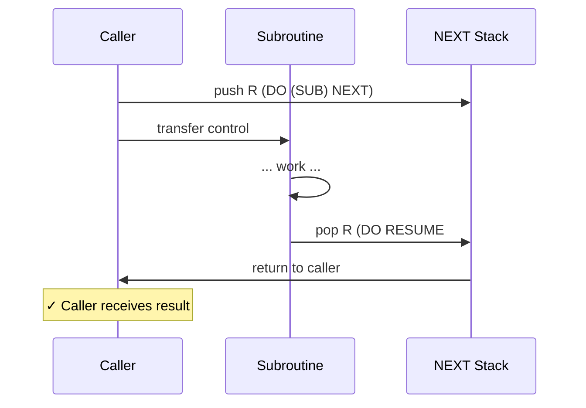
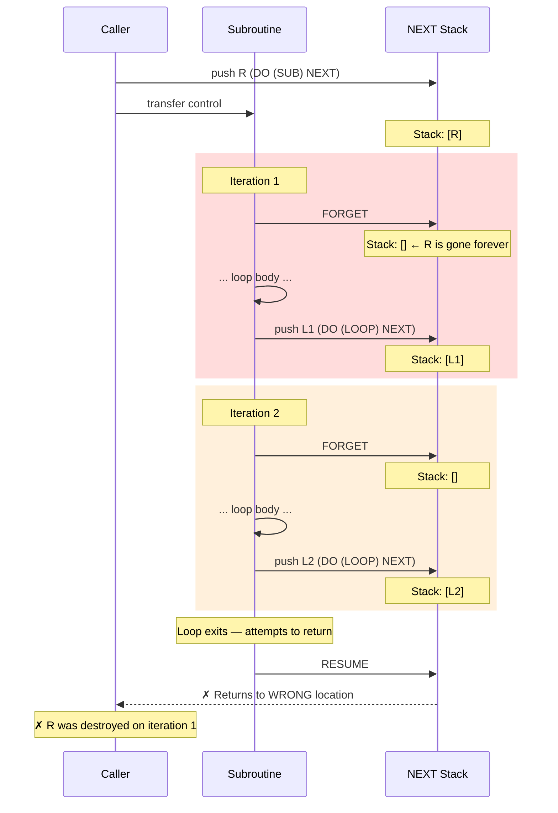
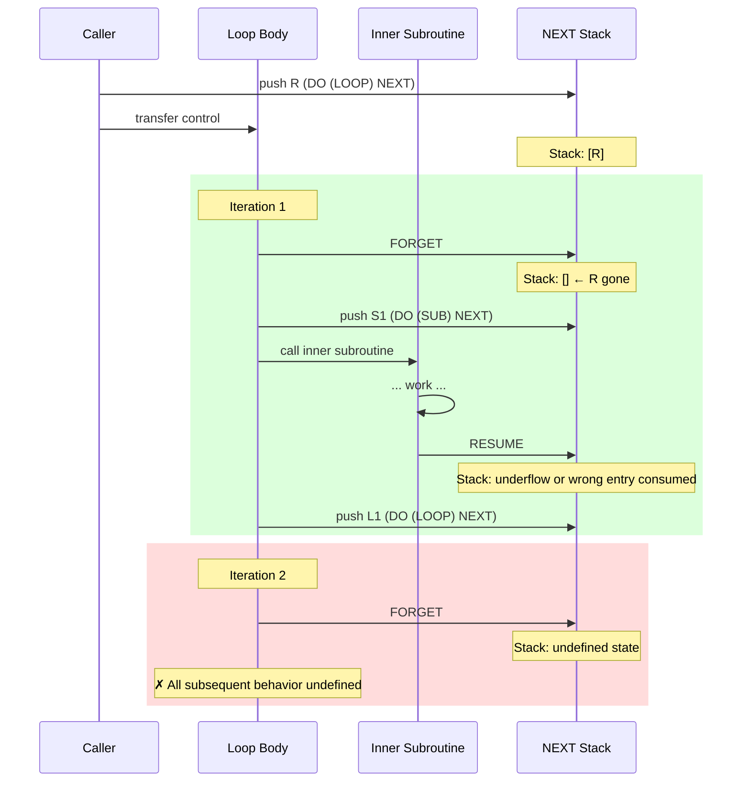
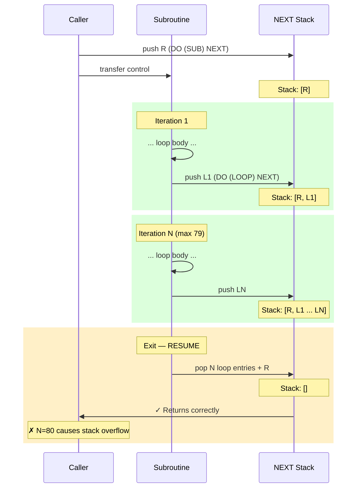
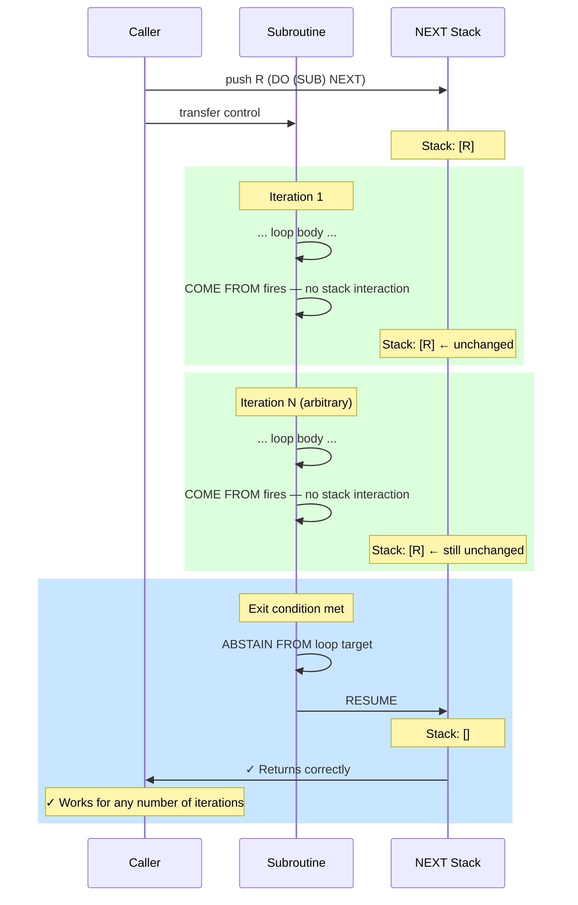
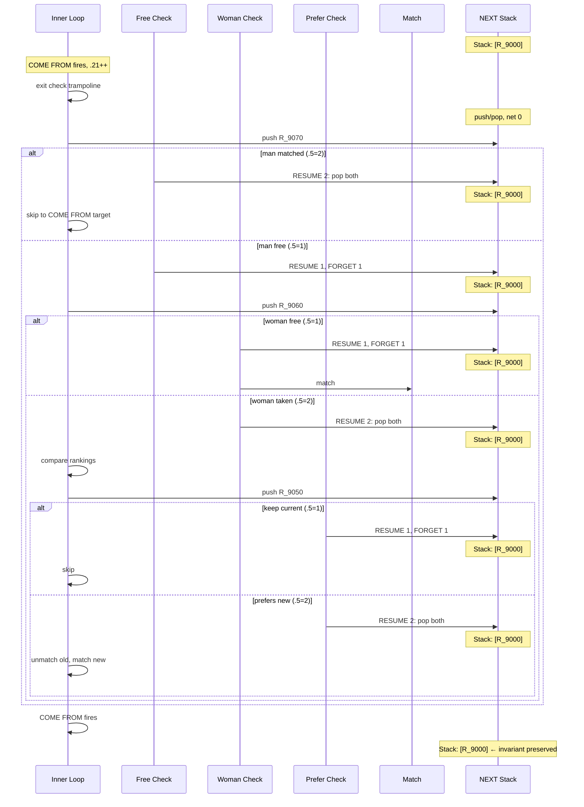

# COME FROM Considered Necessary

**Jason Whittington and Claude (Anthropic)**

Submitted to SIGBOVIK 2026

-----

## Abstract

Dijkstra (1968) proposed that the GO TO statement be abolished from higher-level programming languages. We are here to strengthen his work. We present a formal analysis of the control flow model of INTERCAL-72, the original INTERCAL specification as published by Woods and Lyon in 1972, and prove that INTERCAL-72 is incapable of expressing callable subroutines containing loops of arbitrary length. This limitation follows directly from the semantics of the FORGET statement and the bounded depth of the NEXT stack. We characterize the precise boundary: a callable subroutine in INTERCAL-72 may iterate at most 79 times before exhausting available stack depth. We then examine the COME FROM statement, introduced by Raymond in 1990, and demonstrate that it resolves this limitation completely. COME FROM loops do not interact with the NEXT stack and compose freely with subroutine calls. Raymond, recognizing the incompleteness of the original language, addressed it with characteristic wit. We conclude that COME FROM is not a joke. It is necessary. The language was provably incomplete from 1972 to 1990.

-----

## 1. Introduction

INTERCAL (Compiler Language With No Pronounceable Acronym) was created in 1972 by Donald R. Woods and James M. Lyon at Princeton University as a deliberate parody of contemporary programming languages (Woods and Lyon, 1972). The language was designed to be as different as possible from all existing languages of the time. It succeeded. INTERCAL provides no conventional arithmetic operators, enforces a politeness requirement on source code, and offers control flow mechanisms that bear no resemblance to those of any other language.

Despite its origins as a parody, INTERCAL has attracted sustained attention from the programming language community. Several complete implementations exist, the language has been extended in multiple directions, and a small but non-trivial corpus of programs has been written in it. The present authors have recently extended INTERCAL to support 64-bit integer arithmetic (Whittington and Claude, 2026a).

We present the limitations we discovered, prove them formally, characterize their practical consequences, and demonstrate that they were resolved — apparently with full awareness of their significance — by Raymond’s introduction of the COME FROM statement in 1990.

The analysis in Sections 2 through 5 concerns strictly INTERCAL-72 as specified by Woods and Lyon. No extensions are assumed. Section 6 introduces the relevant extension and analyzes its effect.

-----

## 2. Background: INTERCAL-72 Control Flow

INTERCAL-72 provides three mechanisms for control flow. We describe each in turn.

### 2.1 The NEXT Stack: NEXT, RESUME, and FORGET

The primary subroutine mechanism uses a bounded stack of return addresses called the NEXT stack. The stack has a maximum depth of 80 entries, a limit established by tradition in all known implementations.

The **NEXT** statement transfers control to a labeled statement and pushes a return address onto the NEXT stack:

```intercal
DO (100) NEXT
```

This pushes the address of the statement following the NEXT onto the stack and transfers control to label (100).

The **RESUME** statement pops N entries from the NEXT stack and transfers control to the address at the top after popping:

```intercal
DO RESUME #1
```

This pops one entry and returns to the statement following the NEXT call that pushed it.

The **FORGET** statement discards N entries from the NEXT stack without transferring control:

```intercal
DO FORGET #1
```

This discards the top entry silently. Execution continues at the next sequential statement.

FORGET exists to manage the stack depth during iteration. The idiomatic INTERCAL loop uses FORGET at the top of the loop body to discard the return address pushed by the previous iteration’s NEXT call, keeping the stack depth constant:

```intercal
(100) DO FORGET #1
      ... loop body ...
      DO (100) NEXT
```

On each iteration, the NEXT at the bottom pushes a new return address, and the FORGET at the top of the next iteration discards it. The stack depth remains constant throughout. Figure 1 illustrates the normal operation of NEXT and RESUME in a subroutine without a loop.

**Figure 1: Working subroutine — normal NEXT/RESUME operation.**



### 2.2 ABSTAIN and REINSTATE

The **ABSTAIN** statement causes a labeled statement to be skipped when execution reaches it:

```intercal
DO ABSTAIN FROM (200)
```

The **REINSTATE** statement reverses a prior ABSTAIN:

```intercal
DO REINSTATE (200)
```

ABSTAIN and REINSTATE operate on global state. An ABSTAINed statement is skipped regardless of how execution arrives at it. These statements are used for conditional execution and, in combination with NEXT/RESUME trampolines, for branching.

### 2.3 Comparison and Branching

INTERCAL provides no comparison operators. Conditional branching is achieved through the double-NEXT trampoline idiom, which uses the zero-test expression to produce a value of 1 or 2, and RESUME to pop 1 or 2 entries from the stack, effectively choosing between two execution paths. The zero-test expression for a variable `.1` is:

```intercal
'?"!1~.1'~#1"$#1'~#3
```

This evaluates to 1 when `.1` is zero and 2 when `.1` is nonzero. The result is used as the argument to RESUME to select between two paths established by a pair of NEXT calls.

-----

## 3. The Fundamental Limitation of INTERCAL-72

We now state and prove the central results of this paper.

### 3.1 Definitions

We define a **callable subroutine** as a sequence of statements beginning at a labeled entry point, reachable via a NEXT call from some other location in the program, and expected to return control to the call site via RESUME.

We define a **FORGET-based loop** as a loop implemented using the idiomatic pattern described in Section 2.1: FORGET at the top of the loop body, NEXT at the bottom, with the loop iterating until some exit condition is met.

We define the **caller’s return address** R as the entry pushed onto the NEXT stack by the NEXT call that invoked the subroutine.

### 3.2 Lemma 1: A FORGET-based loop cannot be contained within a callable subroutine

**Proof.**

Let S be a callable subroutine containing a FORGET-based loop. Let the subroutine be invoked by the statement `DO (S) NEXT` at the call site. This pushes R onto the NEXT stack.

At the moment the subroutine begins executing, R is the top entry on the NEXT stack, assuming no NEXT statements have executed inside S before the loop. The FORGET-based loop begins with `DO FORGET #1`.

On the first iteration, `DO FORGET #1` discards the top entry of the NEXT stack. The top entry at this moment is R. Therefore R is discarded on the first iteration.

No subsequent RESUME statement can return to the call site, because R no longer exists on the NEXT stack. RESUME #N for any N will pop entries belonging to callers of the call site, or will fail with a stack underflow error.

Therefore S cannot return to its caller. Since S was defined to be a callable subroutine — one that returns to its call site — this is a contradiction. No such S exists. □

Figure 2 illustrates the failure mode.

**Figure 2: FORGET loop inside a callable subroutine — R destroyed on first iteration.**



**Remark on the sacrificial NEXT pattern.** One might attempt to protect R by pushing a sacrificial entry before the loop:

```intercal
(S)    DO (SACRIFICE) NEXT
(SACRIFICE) DO RESUME #1
```

This pushes and immediately pops a sacrificial entry, leaving the stack unchanged with R still on top. The first FORGET still discards R. The pattern does not resolve the problem.

### 3.3 Lemma 2: A FORGET-based loop cannot call subroutines

**Proof.**

Let L be a FORGET-based loop that calls a subroutine T via `DO (T) NEXT` during each iteration. Each NEXT call pushes an entry E onto the stack. T executes and returns via `DO RESUME #1`, which pops E. At the bottom of the loop iteration, `DO (L) NEXT` pushes a new loop entry.

On the next iteration, `DO FORGET #1` at the top of L discards the top entry. If T’s RESUME #1 popped its own entry cleanly, the top entry is the loop’s own structural NEXT entry — which FORGET correctly discards.

However, if T internally uses RESUME #N for N > 1 — as all syslib routines using the trampoline idiom do — T pops additional entries beyond its own. These additional entries belong to the loop’s stack accounting. FORGET on the next iteration then discards entries that are no longer in the expected position, producing undefined stack state.

In the general case, any subroutine T that uses the double-NEXT trampoline pattern for branching will execute RESUME #2, popping its own entry and one additional entry. This systematically corrupts the loop’s stack accounting. After two iterations the stack state is undefined. □

Figure 3 illustrates the interaction.

**Figure 3: Calling a subroutine from inside a FORGET loop — stack corruption by iteration 2.**



### 3.4 Corollary and Formal Scope

**Corollary (79-iteration bound).** [^1] The only loop construct in INTERCAL-72 that avoids Lemmas 1 and 2 is the stack-accumulating loop: NEXT at the bottom with no FORGET, and a single RESUME #(N+1) at exit to pop all N loop entries plus R. This is bounded by the NEXT stack limit: N + 1 ≤ 80, so N ≤ 79.

**Formal Restatement.** The scope of Lemmas 1 and 2 is precisely the INTERCAL-72 instruction set: NEXT, RESUME, FORGET, ABSTAIN, and REINSTATE. No claim is made about languages in general. The results may be stated as follows:

*Lemma 1 (Restated):* Within the INTERCAL-72 instruction set, no sequence of NEXT, RESUME, FORGET, ABSTAIN, and REINSTATE operations can implement a callable loop — one entered via NEXT and expected to return via RESUME — that preserves the caller’s return address R across more than one iteration.

*Lemma 2 (Restated):* Within the INTERCAL-72 instruction set, no sequence of NEXT, RESUME, FORGET, ABSTAIN, and REINSTATE operations can implement a callable loop that calls subroutines using RESUME #2 or greater within its body and returns correctly to its caller.

The TLA+ model checker verifies these claims by exhaustive enumeration of all reachable states under exactly these operations. The allowable transforms in the model are the INTERCAL-72 operations and nothing else. The model found no counterexample within the specified bounds, confirming that no working pattern exists within this instruction set.

Figure 4 illustrates this pattern.

**Figure 4: Bounded stack-accumulating loop — correct but limited to 79 iterations.**



### 3.5 Theorem: Bounded Expressiveness of Callable Subroutines

**Theorem.** Within the INTERCAL-72 instruction set, the set of computations expressible as callable subroutines is strictly bounded by the remaining NEXT stack depth at call time. Let D be the stack depth available when a subroutine is called (at most 79, since one entry is consumed by the call itself). Then:

1. Any loop within the subroutine may execute at most D iterations (stack-accumulating pattern).
1. Any subroutine call from within the loop reduces the available depth by at least 1 for the duration of the call, reducing the iteration bound accordingly.
1. No loop within the subroutine may call any subroutine that itself uses RESUME #2 or greater (Lemma 2). Since all syslib arithmetic routines use RESUME #2, no callable subroutine can perform iterative arithmetic.
1. Nested loops multiply their iteration bounds against the available stack depth. Two nested loops of depth k and m require k × m ≤ D stack entries.

**Proof.** Follows directly from Lemmas 1 and 2 and the NEXT stack bound of 80 entries. Lemma 1 eliminates FORGET-based loops entirely. The stack-accumulating pattern is the only remaining loop construct, and it consumes one stack entry per iteration. The bound D is therefore a hard ceiling on iteration count. Lemma 2 eliminates subroutine calls from loop bodies when those subroutines use multi-depth RESUME. Since syslib routines use RESUME #2, no loop can call syslib. Since syslib provides all arithmetic operations, no loop can perform arithmetic. Since computation without arithmetic is severely limited, the expressive power of callable subroutines is severely limited. □

**Remark.** This is not a limitation that can be engineered around within INTERCAL-72. It is not a matter of cleverness or patience. The instruction set itself — specifically the interaction between FORGET, RESUME, and the shared NEXT stack — makes it impossible. A callable subroutine in INTERCAL-72 cannot sort a list of arbitrary length. It cannot search an array using comparison subroutines. It cannot perform 64-bit arithmetic by iterating over bits. It cannot process input of unknown length. The ceiling is not low. It is a floor.

We have now characterized the complete boundary of what INTERCAL-72 callable subroutines can express. The boundary is defined not by programmer skill but by the semantics of the language. Section 6 introduces the single extension that removes this boundary entirely.

The theoretical maximum of 2^79 operations assumes a perfectly balanced binary tree of nested calls, each consuming exactly one stack entry, with no loop iterations or subroutine calls of depth greater than one. This bound is not achievable in practice — any meaningful computation consumes additional stack entries, reducing the effective ceiling substantially.

For comparison, no mainstream programming language specifies a fixed language-level call stack limit. Python defaults to 1,000 frames as a software safety limit, easily raised by the programmer. Java supports tens of thousands of frames bounded only by available RAM. C and C++ impose no language-level limit at all. INTERCAL-72’s hard limit of 80 entries — specified in the language definition rather than the implementation, and not configurable — appears to be unique in the literature as a fixed, small, language-level constant.[^3]

-----

## 4. Illustration of the Failure

We illustrate Lemmas 1 and 2 with two minimal programs. Each attempts a simple task — counting from I to V using syslib arithmetic — and each fails on C-INTERCAL, the authoritative reference implementation, with a stack error.

### 4.1 Lemma 1 Reproducer: Callable Subroutine with FORGET Loop

The following program calls subroutine (500), which contains a FORGET-based loop that adds 1 five times and attempts to return the result:

```intercal
        DO .1 <- #0
        DO (500) NEXT
        DO READ OUT .1
        PLEASE GIVE UP

(500)   DO .1 <- #0
(501)   DO FORGET #1
        DO .2 <- #1
        DO (1000) NEXT
        DO .1 <- .3
        DO .2 <- #5
        DO (1010) NEXT
        DO .2 <- .3 ~ #65535
        DO .5 <- "?'.2~.2'$#1"~#3
        DO .5 <- .5 ~ #1
        DO (502) NEXT
        PLEASE RESUME #1
(502)   DO RESUME .5
        DO (501) NEXT
        PLEASE RESUME #1
```

**Expected output:** V

**C-INTERCAL result:** ICL421I ERROR TYPE 421 — NEXT stack overflow

The first `DO FORGET #1` at label (501) discards R, the return address pushed by `DO (500) NEXT`. The subroutine cannot return.

### 4.2 Lemma 2 Reproducer: FORGET Loop with Syslib Calls

The following program uses a top-level FORGET loop to count from I to V, printing each value:

```intercal
        DO .1 <- #0
(100)   DO FORGET #1
        DO .2 <- #1
        PLEASE DO (1000) NEXT
        DO .1 <- .3
        PLEASE DO READ OUT .1
        DO .2 <- #5
        DO (1010) NEXT
        DO .4 <- .3 ~ #65535
        PLEASE DO .5 <- "?'.4~.4'$#1"~#3
        DO .5 <- .5 ~ #1
        DO (300) NEXT
        DO GIVE UP
(300)   DO RESUME .5
        DO (100) NEXT
        PLEASE RESUME #1
```

**Expected output:** I II III IV V

**C-INTERCAL result:** ICL421I ERROR TYPE 421 — NEXT stack overflow

## The FORGET at (100) interacts with the RESUME #2 calls made internally by syslib routines (1000) and (1010), corrupting the stack accounting. By the second iteration the stack state is undefined.

## 5. The Component Problem and Eighteen Years of Incompleteness

The limitation proved in Section 3 was present in INTERCAL from its publication in 1972. The language as specified by Woods and Lyon provides no mechanism for a callable subroutine to contain a loop that calls other subroutines, nor any loop exceeding 79 iterations.

This went unnoticed for eighteen years. The explanation is straightforward: the corpus of INTERCAL programs written before 1990 was extremely small — the original manual notes that only two programs had ever been written in the language at the time of publication — and none of them required callable loops of arbitrary length or loops that called non-trivial subroutines.

### 5.1 Component INTERCAL

Whittington (2019) introduced CRINGE (Common Runtime INTERCAL Next-Generation Engine), a .NET-based INTERCAL implementation that compiles INTERCAL source to .NET assemblies. A significant feature of CRINGE is its support for component-oriented programming: INTERCAL programs compiled as separate assemblies can call between them via the NEXT statement, enabling the construction of reusable INTERCAL library components.

The motivation for a component model is straightforward. Non-trivial INTERCAL programs require arithmetic routines, sorting, and other utilities. Without components, every program must include its own copies of these routines. With components, a shared library can be compiled once and referenced by many programs. The architecture is sound. The standard INTERCAL system library already follows this pattern implicitly.

### 5.2 Components Require Callable Loops

The limitations proved in Section 3 imply that useful components are impossible in INTERCAL-72. Consider what a useful component must do: it must accept inputs, perform some computation, and return results to the caller. For any non-trivial computation, that computation requires iteration. Iteration in INTERCAL-72 requires either FORGET-based loops or stack-accumulating loops. As proved in Section 3, neither is compatible with a component that calls other subroutines or iterates more than 79 times.

The consequences are concrete. DIVIDE32, a 32-bit integer division routine implemented as an MSB-first shift-and-subtract algorithm, requires a loop. Each iteration of the loop calls syslib routines for comparison and subtraction. By Lemma 2, those syslib calls corrupt the FORGET-based loop’s stack accounting. By the corollary to Lemma 1, a stack-accumulating loop cannot exceed 79 iterations — and division of a 32-bit value may require up to 32 iterations, which is within bounds, but each iteration’s syslib calls still trigger the Lemma 2 failure.

Three separate implementations of DIVIDE32 were attempted using FORGET-based and stack-accumulating loop constructs. All three failed to return correctly to their callers. The component model, while architecturarily sound, was undermined by the language’s own control flow semantics. The proof in Section 3 explains why.

The situation is general. Any component implementing a standard algorithm — sort, search, arithmetic, string processing — requires loops that call subroutines. In INTERCAL-72, no such component can exist. The component model is provably impossible in the original language.

-----

## 6. COME FROM

In 1990, Eric S. Raymond produced C-INTERCAL, a complete reimplementation of INTERCAL in C for Unix systems. Among the extensions Raymond introduced was the COME FROM statement, attributed to a proposal by R. L. Clark in Datamation magazine in 1973 (Clark, 1973).

The statement is described in the C-INTERCAL manual as the logical inverse of GO TO. When execution reaches the label referenced by a COME FROM statement, control transfers immediately to the COME FROM statement itself, regardless of the sequential flow of the program:

```intercal
DO COME FROM (300)
```

When execution reaches label (300) anywhere in the program, control transfers to the statement following this COME FROM. COME FROM does not interact with the NEXT stack in any way.

### 6.1 Stack Independence

The critical property of COME FROM is that it does not interact with the NEXT stack in any way. A COME FROM loop:

```intercal
(LOOP)    DO COME FROM (LOOP_END)
          ... loop body ...
(LOOP_END) DO .1 <- .1
```

iterates by transferring control from (LOOP_END) back to (LOOP) on each pass. No NEXT is executed for the loop back-edge. No FORGET is needed. The NEXT stack is completely undisturbed by the iteration mechanism itself.

This means that when a callable subroutine contains a COME FROM loop, R sits on the NEXT stack throughout the entire execution of the loop, untouched. Subroutine calls within the loop body push and pop their own entries normally. When the loop exits, R is still there. RESUME #1 returns cleanly to the caller.

Figure 5 illustrates this property.

**Figure 5: COME FROM loop inside a callable subroutine — stack untouched across all iterations.**



### 6.2 Loop Exit — and Its Insufficiency

Exiting a COME FROM loop uses ABSTAIN to disable the loop’s back-edge, followed by RESUME to return:

```intercal
(LOOP)    DO COME FROM (LOOP_END)
          ... loop body ...
          DO ABSTAIN FROM (LOOP)        <- exit condition met
(LOOP_END) DO .1 <- .1                 <- COME FROM disabled, falls through
          DO RESUME #1                  <- R is intact, returns correctly
```

Note that ABSTAIN must target the COME FROM statement itself (label LOOP), not the COME FROM’s target (label LOOP_END). ABSTAINing the target prevents the statement at LOOP_END from executing but does not prevent COME FROM from firing. This distinction cost the present authors several hours of debugging.

This pattern is elegant but incomplete. It handles the loop mechanism — the back-edge is stack-free and R is preserved. But it does not address conditional branching *within* the loop body. When must the loop exit? Should this iteration take path A or path B? INTERCAL provides no conditional mechanism that does not involve the NEXT stack.

The only conditional branching construct available is the trampoline described in Section 2.3: a pair of NEXT calls whose RESUME depth is controlled by the zero-test expression. This construct pushes entries onto the NEXT stack. If these entries are not correctly consumed within each iteration, they accumulate across iterations and eventually corrupt the stack or exhaust the 80-entry limit.

COME FROM solves the iteration problem. It does not solve the branching problem. A complete solution requires both COME FROM for the loop back-edge and a stack-correct trampoline pattern for conditionals within the loop body. This is the subject of Section 7.

### 6.3 The Corrected Implementation

The corrected implementation of the programs from Section 4 uses the COME FROM loop pattern described above, combined with the double-NEXT trampoline pattern described in Section 7. The complete working programs are given in Section 8, where their empirical results are reported.

The critical structural difference is that the loop back-edge has zero stack interaction. COME FROM fires and returns control to the top of the loop without touching the NEXT stack. R sits undisturbed throughout all iterations. The component model is rescued.

-----

## 7. Beer Reveals the Answer

The proofs in Sections 3 and 4 establish that FORGET-based loops cannot function as callable subroutines. A reader familiar with the INTERCAL community might at this point recall Matt Dimeo’s `beer.i` — a complete implementation of 99 Bottles of Beer in INTERCAL, written years before this investigation. Beer.i works. It uses loops. The apparent contradiction deserves explanation.

Beer.i uses COME FROM loops, not FORGET loops. The Lemmas apply only to FORGET-based iteration. Beer.i’s loops are therefore outside the scope of the impossibility results entirely — they are not counterexamples but illustrations of the alternative.

More interesting is what Dimeo did next. Having chosen COME FROM for his loop back-edge, he faced a practical problem: he needed conditional exit. A COME FROM loop runs until something stops it. The exit mechanism must be implemented explicitly by the programmer. Dimeo’s solution was the double-NEXT wrapper:

```intercal
          DO (outer) NEXT         \* push R_outer
          ... continue-loop path ...
(outer)   DO (inner) NEXT         \* push R_inner
          DO GIVE UP              \* exit path
(inner)   DO RESUME .5            \* .5=1: exit; .5=2: continue
```

With the zero-test value `.5` taking values in `{1,2}` directly:

- `.5=1` (done): RESUME 1 pops R_inner, returns inside outer, hits GIVE UP
- `.5=2` (not done): RESUME 2 pops R_inner and R_outer, returns to the continue-loop path leading back to the COME FROM target

This pattern requires no FORGET for loop management. R_outer and R_inner are temporary entries pushed and consumed within a single iteration. R, the caller’s return address, is never touched.

Dimeo did not derive this pattern from formal analysis. He needed conditional branching inside a loop and invented a mechanism that happened to be correct. Beer.i is an accidental constructive proof that callable COME FROM loops are possible.

To determine whether the beer.i double-NEXT pattern is the unique minimal working pattern or merely one of several, we applied model checking with an inverted property. Rather than asking TLC to verify that the working pattern is correct, we asked TLC to prove that correct return is impossible — and examined the counterexamples.

The inverted invariant:

```tla
StackAlwaysCorrupted ==
  ~(phase = "returning" /\ rConsumed = TRUE /\ iterations >= 1)
```

This asserts that the stack is always corrupted at return — that is, R is never correctly consumed. Any state that violates this invariant represents a working pattern.

TLC, given all possible loop constructs and stack operations as allowable transforms, found the following counterexample as the shortest violation:

1. EnterLoop — COME FROM fires, stack = <<“R”>> (untouched)
1. BodyDone — no syslib calls this iteration
1. SetDone — exit condition met
1. PushROuter — stack = <<“R_out”, “R”>>
1. PushRInner — stack = <<“R_in”, “R_out”, “R”>>
1. ResumeOneDone — RESUME 1 pops R_in, stack = <<“R_out”, “R”>>
1. ForgetROuter — FORGET discards R_out, stack = <<“R”>>
1. ResumeToCall — RESUME 1 pops R, rConsumed = TRUE ✓

This is the beer.i double-NEXT pattern. TLC did not know about beer.i. It was given the INTERCAL stack semantics and asked to find states where correct return is achievable. It independently derived the same pattern Dimeo invented to make a beer program work.

### 7.1 Uniqueness

The inverted-invariant model demonstrates that the pattern *can* work, but does not exclude alternatives. To establish uniqueness, we constructed a second model (`TrampolineSearch.tla`) that allows arbitrary sequences of NEXT pushes, RESUME pops, and FORGETs within the trampoline phase, subject to two constraints that reflect the physical reality of INTERCAL source code:

1. **Fixed structure across iterations.** The number of pushes before RESUME must be identical on every iteration. INTERCAL source code is static — the trampoline structure is compiled once and executes the same way each time. The only variable is the RESUME depth (`.5 = 1` or `.5 = 2`), which is computed at runtime.

2. **Path selection via RESUME depth.** The continue path (loop again) is selected by RESUME 2. The exit path (leave the loop) is selected by RESUME 1. This is the only conditional mechanism available: the zero-test expression produces a value in `{1, 2}`, and RESUME pops that many entries.

TLC exhaustively explored 9,050 distinct states — all possible combinations of 1 to 6 pushes, forgets, and resumes with up to 6 trampoline steps per iteration, across 3 iterations — and found exactly one working pattern: **push two entries, then RESUME `.5`**.

No other push count works. Push 1 does not provide enough entries for RESUME 2 to pop. Push 3 or more leaves residual entries that accumulate across iterations. Push 2 is the unique fixed point: RESUME 2 consumes both entries (net zero, loop continues), and RESUME 1 consumes one entry, leaving one for FORGET to discard (net zero, loop exits).

The beer.i double-NEXT trampoline is not merely a working pattern. It is the *only* pattern.

-----

## 8. Empirical Confirmation

Section 7 established the beer.i double-NEXT pattern as the minimal correct loop structure, confirmed independently by TLC. The following programs implement exactly that pattern for each lemma and were compiled and run on C-INTERCAL version 0.31.

### 8.1 Lemma 1 Fix: Callable Subroutine with COME FROM Loop

```intercal
        DO .1 <- #0
        DO (500) NEXT
        PLEASE DO READ OUT .1
        DO GIVE UP

(500)   DO .1 <- #0
        DO COME FROM (599)
        DO .2 <- #1
        PLEASE DO (1000) NEXT
        DO .1 <- .3
        DO .2 <- #5
        DO (1010) NEXT
        DO .4 <- .3 ~ #65535
        PLEASE DO .5 <- "?'.4~.4'$#1"~#3
        DO (80) NEXT
(599)   DO .6 <- #0
(80)    PLEASE DO (81) NEXT
        DO FORGET #1
        DO RESUME #1
(81)    DO RESUME .5
```

**C-INTERCAL output:** V

### 8.2 Lemma 2 Fix: Top-Level COME FROM Loop

```intercal
        DO .1 <- #0
        DO COME FROM (99)
        DO .2 <- #1
        PLEASE DO (1000) NEXT
        DO .1 <- .3
        PLEASE DO READ OUT .1
        DO .2 <- #5
        DO (1010) NEXT
        DO .4 <- .3 ~ #65535
        PLEASE DO .5 <- "?'.4~.4'$#1"~#3
        DO (80) NEXT
(99)    DO .6 <- #0
(80)    PLEASE DO (81) NEXT
        DO GIVE UP
(81)    DO RESUME .5
```

**C-INTERCAL output:** I II III IV V

Both programs implement the beer.i double-NEXT wrapper identified in Section 7, using the raw `{1,2}` zero-test value directly in RESUME. Both produce correct output on C-INTERCAL. This is the pattern TLC independently derived as the minimal correct sequence when asked to find all states where correct return is achievable.

|Program                               |SCHRODIE           |C-INTERCAL         |
|--------------------------------------|-------------------|-------------------|
|Lemma 1 broken (callable FORGET loop) |Hangs              |ICL421I E421       |
|Lemma 2 broken (top-level FORGET loop)|Hangs              |ICL421I E421       |
|Lemma 1 COME FROM fix                 |Hangs (Bug 3)      |**V** ✓            |
|Lemma 2 COME FROM fix                 |**I II III IV V** ✓|**I II III IV V** ✓|

SCHRODIE’s failure on the Lemma 1 COME FROM fix is a known compiler bug (Appendix A, Bug 3). This bug does not affect the validity of the C-INTERCAL results.

-----

## 9. Stress Test: Gale-Shapley Stable Matching

Having established the theory (Sections 3–5), the mechanism (Sections 6–7), and the empirical confirmation on small programs (Section 8), we attempted something ambitious: the Gale-Shapley stable matching algorithm (Gale and Shapley, 1962) for n = 5.

Gale-Shapley requires nested loops (outer: while unmatched men exist; inner: for each man, propose to his next preferred woman), three conditional branches per inner iteration (is the man free? is the woman free? does the woman prefer the new suitor over her current partner?), subroutine calls for arithmetic and array indexing, and state tracking across iterations. This exercises every pattern from Sections 6 and 7 simultaneously.

### 9.1 The Implementation

The implementation uses nested COME FROM loops for the outer and inner iteration, three beer.i double-NEXT trampolines per inner iteration for conditional branching, linearized arrays for O(1) preference lookup, and a subroutine for index computation. Figure 8 illustrates the control flow for a single inner loop iteration.

**Figure 8: Gale-Shapley inner loop — three trampolines per iteration, nested COME FROM.**



### 9.2 The Struggle

The initial implementation produced all 10 correct matches — verified by tracing the match subroutine — but the program never terminated. After the final match, the outer loop's exit check correctly detected .22 = 0 (all men matched), but RESUME #1 returned to the inner loop body instead of the caller.

We suspected the multi-trampoline pattern was fundamentally unsound. Three trampolines per iteration, each pushing and popping entries, with syslib calls between them — the interactions seemed too complex to manage manually.

### 9.3 Formal Verification

Before continuing to debug, we constructed a TLA+ model of the COME FROM loop with N double-NEXT trampolines per iteration, each following the beer.i pattern including the FORGET #1 cleanup on the inside path. We asked TLC to check whether the stack depth returns to its baseline after each complete iteration, for all 2^N path combinations across multiple iterations.

For N = 3 trampolines and 4 iterations, TLC explored all reachable states and found no invariant violations.

The pattern is correct. The bug was in our code.

### 9.4 The Fix

With the TLA+ result eliminating the hypothesis of a fundamental limitation, we examined the generated C# and traced the stack state through the exit path. The bug was immediately apparent: the inner exit trampoline at (9080)/(9081) followed the beer.i double-NEXT pattern, but the exit path — which fell through to the outer loop check code — was missing the FORGET #1 that discards R_outer after RESUME 1.

Without this FORGET, R_outer (from `DO (9080) NEXT`) remained on the stack. The outer exit trampoline's RESUME #1 popped R_outer instead of R_9000, returning to the inner loop body instead of the caller.

The fix was a single line:

```intercal
(9080)  DO (9081) NEXT
        DO FORGET #1          <- this line was missing
        ... outer check code ...
```

This is precisely Constraint 3 from Section 7: every trampoline's inside path must FORGET its R_outer immediately. We had documented this requirement and then violated it in our own code.

### 9.5 Result

The corrected program produces the stable matching M1-W1, M2-W2, M3-W4, M4-W5, M5-W3 — the correct Gale-Shapley output for the test dataset, requiring 10 rounds of proposals including 6 rejections and 2 partner upgrades.

-----

## 10. Conclusions

We began with an engineering problem: division could not be implemented as a callable component. Three implementations failed. Investigation revealed that the failures were not incidental but inevitable — a consequence of FORGET’s indiscriminate stack management in the presence of subroutine calls.

We have proved that INTERCAL-72 cannot express callable subroutines containing loops that call other subroutines, nor loops exceeding 79 iterations. The practical consequence is that a component model for INTERCAL is provably impossible in the original language. Any non-trivial component requires loops that call subroutines. No such component can return to its caller.

The COME FROM statement, introduced by Raymond in 1990, resolves the iteration limitation completely. Combined with the double-NEXT trampoline pattern — independently derived by Matt Dimeo and by TLC model checking — it also resolves the branching limitation. TLA+ formal verification confirms that multiple trampolines compose correctly within a single COME FROM loop iteration, and the Gale-Shapley stable matching implementation demonstrates that these patterns scale to non-trivial algorithms with nested loops, multiple conditionals, and subroutine calls.

In every other language, structured control flow replaced the unconditional jump. In INTERCAL, the anti-goto turns out to be the only thing that makes loops actually work — not because of software engineering principles, but because of a provably broken stack.

GO TO may be considered harmful. COME FROM is considered necessary.[^2]

-----

-----

## Acknowledgments

The authors thank Matt Dimeo for the 99 Bottles of Beer implementation (Dimeo, n.d.), whose COME FROM loop structure provided the key insight for this work. Jim Howell’s INTERCAL Pit at ofb.net/~jlm is an invaluable resource for the INTERCAL community and deserves recognition as the primary repository of INTERCAL programs and literature.

The authors thank Eric S. Raymond, without whose sense of humor this paper would have no conclusion, and whose insight gave INTERCAL the construct it needed.

The formal verification in this paper was conducted using TLA+ and the TLC model checker, developed by Leslie Lamport and the TLA+ team at Microsoft Research. The complete specifications for both the impossibility results and the working pattern verification are available in the `analysis/` directory of the project repository (github.com/jawhitti/INTERCAL).

-----

## References

Calvin, C. (2001). CLC-INTERCAL reference manual. Available at http://www.intERCAL.org.uk/.

Clark, R. L. (1973). A linguistic contribution to GOTO-less programming. *Datamation*, 19(12), 62–63.

Dimeo, M. (n.d.). 99 Bottles of Beer in INTERCAL. Available via the INTERCAL Pit, ofb.net/~jlm.

Lamport, L. (2002). *Specifying Systems: The TLA+ Language and Tools for Hardware and Software Engineers*. Addison-Wesley. toolbox.tlaplug.org. Available via the INTERCAL Pit, ofb.net/~jlm.

Dijkstra, E. W. (1968). Go to statement considered harmful. *Communications of the ACM*, 11(3), 147–148.

Gale, D. and Shapley, L. S. (1962). College admissions and the stability of marriage. *The American Mathematical Monthly*, 69(1), 9–15.

Howell, J. The INTERCAL Pit. ofb.net/~jlm.

Raymond, E. S. (1990). C-INTERCAL reference manual. Available at catb.org/esr/intercal.

Stross, C. (2015). Published for the first time: the Princeton INTERCAL compiler’s source code. esoteric.codes.

Whittington, J. (2019). CRINGE: Common Runtime INTERCAL Next-Generation Engine. github.com/jawhitti/INTERCAL.

Whittington, J. and Claude (Anthropic). (2026a). Optimal graph traversal under adversarial constraints: A bitwise approach to memory-constrained environments. *Proceedings of SIGBOVIK 2026*.

Whittington, J. and Claude (Anthropic). (2026b). Hilbert curve geographic indexing in INTERCAL-64. Manuscript in preparation.

Woods, D. R. and Lyon, J. M. (1972). *The INTERCAL Programming Language Reference Manual*. Princeton University.

-----

Ertl, A., et al. Gforth Manual. Available at complang.tuwien.ac.at/forth/gforth/Docs-html/. Section: Return Stack Tutorial.

Koopman, P. (1989). *Stack Computers: The New Wave*. Ellis Horwood. Available at users.ece.cmu.edu/~koopman/stack_computers/.

Moore, C. H. (1974). FORTH: A new way to program a mini-computer. *Astronomy and Astrophysics Supplement Series*, 15, 497–511.

Whittington, J. and Claude (Anthropic). (2026a). Optimal graph traversal under adversarial constraints: A bitwise approach to memory-constrained environments. *SIGBOVIK 2026*.

Whittington, J. and Claude (Anthropic). (2026b). Hilbert curve geographic indexing in INTERCAL-64. Manuscript in preparation.

Woods, D. R. and Lyon, J. M. (1972). *The INTERCAL Programming Language Reference Manual*. Stanford University.

-----

## Appendix A: SCHRODIE Compiler Bugs

Testing against C-INTERCAL revealed three bugs in SCHRODIE that cause incorrect programs to appear to work.

**Bug 1: RESUME #0 treated as no-op.** The RESUME implementation uses `while (_popped < depth && _nextStack.Count > 0)`, which silently does nothing when depth=0. C-INTERCAL correctly throws E621. Impact: all programs using `.5 ~ #1` + `RESUME .5` appear correct on SCHRODIE but are broken.

**Bug 2: FORGET on empty stack silently ignored.** The FORGET implementation guards with `_nextStack.Count > 0`, silently succeeding when the stack is empty. C-INTERCAL throws E621. Impact: stack underflow goes undetected.

**Bug 3: COME FROM + syslib inside callable subroutine hangs.** The Lemma 1 COME FROM fix works correctly on C-INTERCAL but hung on SCHRODIE. Root cause: each compiled component had its own isolated `_nextStack`. Cross-assembly calls communicated RESUME depth via a `NextStackDepth` field, but the translation corrupted return labels when the caller’s stack had entries from enclosing subroutine calls. **Fixed** by moving the NEXT stack to a shared instance on `ExecutionContext`, matching C-INTERCAL’s single-stack semantics. All lemma programs and the Gale-Shapley implementation now produce correct output on both compilers.

These bugs do not affect the paper’s formal results, which are derived from language semantics rather than compiler behavior. All empirical claims cite C-INTERCAL results.

-----

[^1]: The 79-iteration bound has immediate practical consequences. Bubble sort on an array of M elements requires at most M(M-1)/2 comparisons in the worst case. As a callable subroutine in INTERCAL-72, bubble sort is limited to arrays of at most 13 elements: 13 × 12 / 2 = 78 ≤ 79, while 14 × 13 / 2 = 91 > 79. The authors note that bubble sort on 13 elements requires exactly 78 iterations in the worst case, leaving one stack entry to spare. This margin provides no comfort.

[^2]: The formal results presented here have unblocked a number of further investigations, including implementations of Morton code spatial indexing and Hilbert curve geographic encoding and range search in INTERCAL-64. These are left for future work.

[^3]: The authors note that this constraint is, perversely, part of INTERCAL’s appeal as a recreational language. A problem space small enough to fit in 79 stack entries is a problem space well-suited to a weekend afternoon. The language does not encourage ambition. This is a feature.
